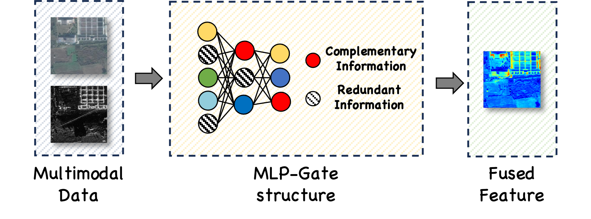

# MGFNet-MLP-Gated-Fusion-Network
A Deep-Learning method for optical and SAR semantic segmentation 

- JAG: Under Review



1. __Installation__:

- python >= 3.8
- torch >= 1.12.0
- torchvision >= 0.13.0
- gdal >= 3.4.1

Then, install the required packages with:

```
pip install -r requirements.txt
```

2. __Dataset Preparation__:

- Just download the dataset and extract it to the `datasets` folder.
- To generate the `train.txt` and `val.txt` files to save weights when training, run the python scripts in `tools`:

```
dataset_split.py: generate randomly
dataset_split_sss.py: generate using stratified sampling
```

1. __Configuration__:

- Sample configuration for YESeg-OPT-SAR can be found `configs`. Then edit the fields you think if it is needed. This configuration file is needed for all of training and evaluation scripts.

2. __Training__:
   To train a baseline, run the following command:

- Train with single GPU, set `DP` and `DDP` in the configuration file to `False`:

```
$ python scripts/train_unet.py --cfg configs/CONFIG_FILE.yaml
```

- Train with multiple GPUs by DP, set `DP`in the configuration file to `True`:

```
$ python scripts/train_unet.py --cfg configs/CONFIG_FILE.yaml
```

- Train with multiple GPUs by DDP, set`DDP` in the configuration file to `True`, and `nproc_per_node` denotes the number of GPUs:

```
$ python -m torch.distributed.launch --nproc_per_node=2 --use_env scripts/train.py --cfg configs/<CONFIG_FILE_NAME>.yaml
```

3. __Evaluation__:

- Make sure to set `MODEL_PATH` of the configuration file to your trained model directory.
- __NOTE__: If use `DP` in training, set `DP` in evaluation to `True`, and vice versa.
- To evaluate a trained model, run the following command:

```
$ python scripts/val_unet.py --cfg configs/CONFIG_FILE.yaml
```
4. __Links__:
- YESeg-OPT-SAR: [https://github.com/yeyuanxin110/YESeg-OPT-SAR/](https://github.com/yeyuanxin110/YESeg-OPT-SAR/)
- DDHRNet Datasets: [https://github.com/BlackSmithM/DDHRNet](https://github.com/BlackSmithM/DDHRNet)
- Pretrain Weights(ImageNet-1k): [https://drive.google.com/drive/folders/17Hlq7GpA5Ijjqs1yQTaPRRbQCcPLWTwh?usp=sharing](https://drive.google.com/drive/folders/17Hlq7GpA5Ijjqs1yQTaPRRbQCcPLWTwh?usp=sharing)
### 
